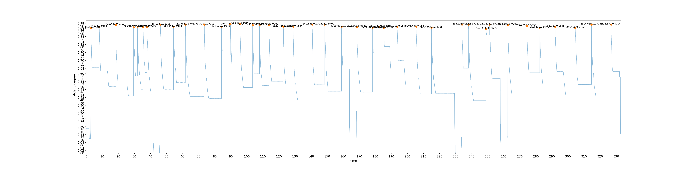

# WORLD DAI STAR ASS BUILDER

This is a tool to generate a rough subtitle file for World Dai Star story(not stage show).

Using `OPENCV2` to create an analysis chart like this

As you can see，the point of mutation is where a word begins.<br />
So, you can also change the image of dialogue box(in `asset` folder) to make this tool universal to other games.

# Usage

## Install from the repository

```
git clone https://github.com/DreamGallery/World-Dai-Star-ASS-Builder.git
cd World-Dai-Star-ASS-Builder
```

## Install requirements

```
pip3 install -r requirements.txt
```

## Run with terminal

Edit `[Info]` in `config.ini` first, put video file in `video`, and run with

```
python main.py
```

The `.ass` file will saved in `ass` and you can find the image of analysis chart in `cache` with the name you set for subtitle.

## Last of all

The generated subtitle timeline just a rough ones, so don't place too much hope on the accuracy of the tool, and there are still some places need you to correct, but it can actually improve a lot of efficiency.<br />
Because there may be some filters after narrations, you can slightly reduce the value of `Degree_Threshold`.

In the end, I hope you can enjoy the story of `World Dai Star`!
